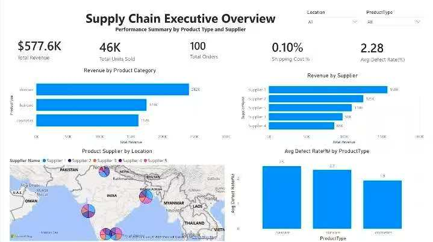
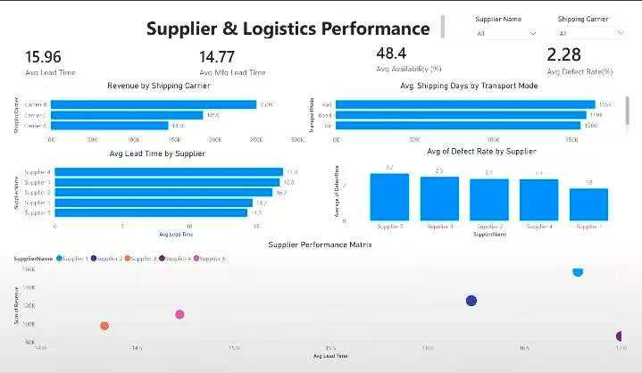
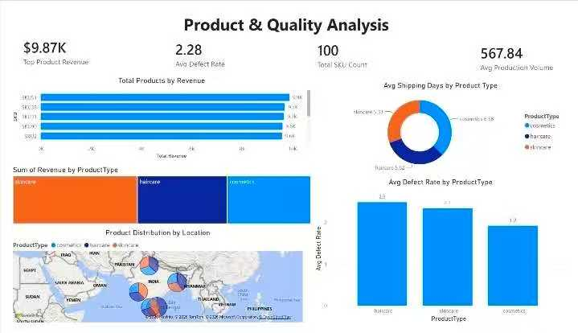
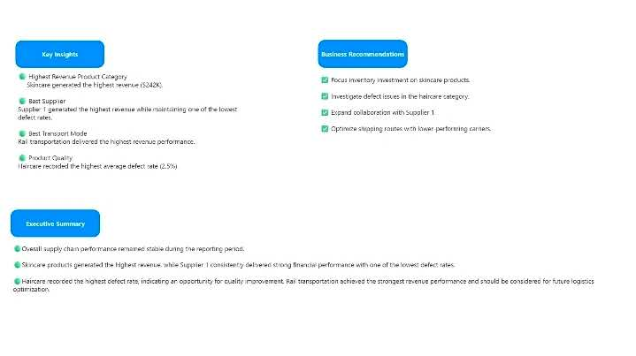

# Supply Chain Power BI Dashboard

A Power BI dashboard developed to help supply chain stakeholders monitor supplier performance, logistics efficiency, inventory operations, and product quality across the supply chain.

---

# Project Overview

This dashboard was created to provide procurement managers, supply chain leaders, and business stakeholders with a centralized view of operational performance.

The dashboard enables users to:

- Monitor supplier performance
- Evaluate logistics efficiency
- Analyze product quality
- Track operational KPIs
- Support supply chain decision making

---

# Project Information

| Item | Details |
|------|---------|
| Industry | Supply Chain & Logistics |
| Role | Power BI Developer |
| Tools | Power BI, DAX, Power Query |
| Data Source | Kaggle Supply Chain Dataset |
| Dashboard Type | Executive Dashboard |
| Audience | Supply Chain Managers, Procurement Teams, Business Stakeholders |
| Skills | Data Modeling, KPI Design, Supply Chain Analytics, Data Visualization |

---

# Dashboard Preview

## Executive Overview

Provides a high-level overview of revenue, product categories, supplier performance, operational KPIs, and product quality.

---

## Supplier & Logistics Performance

Evaluates supplier lead time, logistics performance, transportation efficiency, manufacturing lead time, and supplier quality metrics.

---

## Product & Quality Analysis

Analyzes product revenue, SKU performance, product categories, defect rates, and product distribution across locations.

---

## Executive Summary & Business Recommendations

Summarizes key business insights and provides actionable recommendations for improving supply chain performance.

---

# Business Problem

Supply chain organizations often struggle to answer questions such as:

- Which suppliers generate the highest revenue?
- Which
